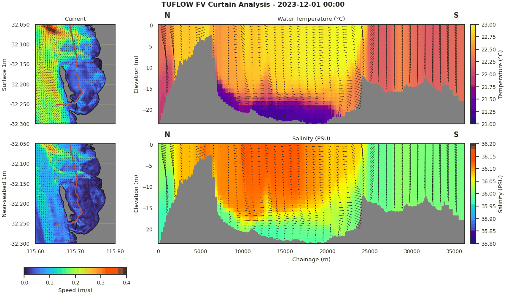

[](https://www.repostatus.org/#wip)

# csiem-marvl : plotting and visualisation tools for CSIEM

## Overview
<a href="url"></a>
`csiem-marvl` refers to the Cockburn Sound Integrated Ecosystem Model - Model Assessment, Reporting and Visualisation Library, which is a collection of scripts and tools for assisting users visualise model outputs and observational datasets, and for evaluating the model's performance. `csiem-marvl` uses the more generic `aed-marvl` package for core functions for plotting and evaluating model output, in addition to a suite of custom scripts developed for specific applications. 

## Repository Organisation
- `aed-marvl`: core plotting and model performance evaluation scripts for AED simulations; 
- `configs`: pre-saved configuration setups for csiem plotting tasks;
- `custom_m`: a library of matlab scripts associated with custom model assessment and reporting;
- `custom_py`: a library of pyhton scripts associated with custom model assessment and reporting;
- `data`: place-holder for storing observed/modelled datasets (users will add data into here);
- `gis`: shape files for defining polygons, transect, and sites for plotting;
- `outputs`: place-holder folder users must create where locally generated outputs can reside;

## Getting started

To access the repository, use a client like GitHub Desktop, or download from the command line via:

`git clone git@github.com:SEAF-CS/csiem-marvl`

Once you have the main repository, create an `output` directory to store items that are created. 

### Running aed-marvl for polygon time-series plots

- For the aed-marvl polygon-timeeries plotting, open Matlab (version 2020 or later), go to the local `csiem-marvl` folder and add the paths to tools/libraries by entering:
 ```
 addpath(genpath('./'))
 ```
- Go to `config` folder, edit the `MARVL.m` to configure the plots (use the 'MARVL.m' under example folder as templates);
- Under the `config` path, start the plotting by entering
 ```
  run_AEDmarvl('./MARVL.m','matlab')
 ```
   or if you wish to use YAML style configuration
 ```
   run_AEDmarvl('./MARVL.m','yaml')
 ```

- For these scripts to work effectively, the data products from the `csiem-data` repository must be sourced and added to the `data` folder. For more information on the observed data available for these scripts, please visit the csiem-data [wiki](https://github.com/SEAF-CS/csiem-data/wiki) 

### Running custom matlab scripts

- For the custom matlab scripts (organised in `custom_m`), you can run locally or in a virtual machine. 

### Running custom python scripts

- For the custom python scripts (organised in `custom_py`), you can run locally or they have also been design to run in the cloud-based Databricks environment. 


## Further Information

For the key features and modules of `aed-marvl` the readers are refered to https://github.com/AquaticEcoDynamics/aed-marvl. MARVL user documentation is available the repository (under docs/MARVL user instruction), and refer to the example templates for configuration.

For an overaching summary of the data ecosystem, please see the [The Cockburn Sound Integrated Ecosystem Model Manual](https://aquaticecodynamics.github.io/csiem-science/index.html)

 

## Contributing

The `csiem-marvl` team welcomes collaborators, and encourages pull-requests for improvements and additions to the scripts.

